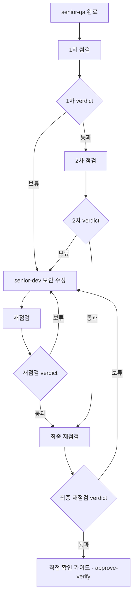

# Delivery Phase (6 steps)

## Instructions

Work **only the current Phase** and **only the current step**. Do not start the next Phase until Human Verify.

At the start of each reply for this Phase work, state the active role line, e.g.
`역할: 시니어 설계` (orchestrator: which specialist you launched).

You are the **orchestrator**. Do **not** write specialist artifacts yourself.

### Role map (launch this agent)

| Step | Launch (sequential if several) | Skill Quality bar |
|------|--------------------------------|-------------------|
| 1 Explore | `senior-architect` | `senior-architect` |
| 2 Document | `senior-architect` or `senior-pm` (doc type) | matching skill |
| 3 Plan | `senior-pm` then, if UI, `senior-design` | `senior-pm`, `senior-design` |
| 4 Implement | `senior-dev` | `senior-dev` (사람 고른 Stack + design spec if UI) |
| 5 Verify | `senior-qa` then (code Phase) `senior-security` | `senior-qa`, `senior-security` |
| 6 Review | `senior-qa` then `senior-architect` then (last Phase) `senior-security` | all |

### Specialist launch (required)

1. Pick agent(s) from the Role map (or user override). Several → **sequential**.
2. Launch with the host adapter:
   - **Cursor:** custom subagent / Task `subagent_type` = agent `name` (`.cursor/agents/<name>.md`)
   - **Claude Code:** `.claude/agents/<name>.md`
   - **Codex:** spawn `.codex/agents/<name>`
   - **Antigravity:** `invoke_subagent` (`.agents/agents/<name>.md`)
3. **입력 패키지** (자식은 대화 이력이 없음): current step, In/Out, paths to related docs/plans, previous specialist artifacts, **Stack (Frontend / Backend / Database)** when implementing. No `.env` secrets.  
   For **`senior-security`**: add **scope** + **round** (`1차` | `2차` | `재점검` | `최종 재점검`) + prior findings when re-scanning. Phase diff at Verify; branch at last Review.
4. If spawn API is missing: **Isolation Pass** — `▶ 전문 에이전트 시작: 시니어 ○○` then follow **only** that skill, then `▶ 전문 에이전트 종료`. Do not mix other roles in that block.
5. After specialists return: 한눈 그림 (when required), 지금 볼 곳, AskQuestion. Mutating `gate.sh` only after an explicit human choice this turn.

Fail: writing plan body, visual spec, app code, or UTG as the orchestrator without launching the specialist (or Isolation Pass).

### Mandatory specialist ownership (건너뛰기 금지)

오케스트레이터는 **Role map의 담당 에이전트만** 해당 산출물을 쓴다. spawn이 없어도 **Isolation Pass**로 동일 역할을 수행한다. “빠르게” 한 에이전트가 기획·디자인·개발·QA를 섞으면 **실패**.

| 산출물 | 담당 (필수) | 오케스트레이터 직접 작성 |
|--------|-------------|-------------------------|
| Explore·구조·영향 범위 | `senior-architect` | 금지 |
| Plan 본문·In/Out·Phase Goal | `senior-pm` | 금지 |
| **UI 시각 스펙** (레이아웃·타이포·색·컴포넌트·상태) | **`senior-design`** (UI Phase **필수**) | **금지** |
| 앱 코드·CSS·컴포넌트 구현 | `senior-dev` | 금지 |
| 테스트·직접 확인 가이드 | `senior-qa` | 금지 |
| **보안 점검·재점검** (1차→2차 또는 재점검→최종 재점검) | **`senior-security`** (코드 Phase **필수**) | **금지** |
| **보안 수정** (Verify 보류 findings) | `senior-dev` | 금지 |
| Verify/Review 아키텍처 점검 | `senior-architect` | 금지 |

**UI Phase 판별:** 이 Phase In/Out에 화면·레이아웃·CSS·컴포넌트·사용자 입력 UI가 있으면 UI Phase. API-only·CLI·배치만이면 UI 아님.

**Plan (3단계) — UI Phase일 때 (필수 순서):**

1. `./scripts/gate.sh phase-ui true` (gate enabled일 때)
2. Launch `senior-pm` → Plan 본문
3. Launch `senior-design` → **시각 스펙** (Plan의 `## Design spec` 절 또는 `.cursor/plans/<phase>-design-spec.md`). `역할: 시니어 디자인` 블록 필수.
4. 사람 승인 메뉴 전: 디자인 스펙이 없으면 Implement 선택 UI를 **내지 않는다**.

**Plan — UI 없을 때:** `./scripts/gate.sh phase-ui false`. `senior-design` 생략.

**Implement 승인 (채팅 ④-1):** gate enabled일 때 순서 고정:  
`approve-plan-body` → (UI면 `phase-ui true` + `senior-design` + `approve-design-spec`) → `advance implement` → Stack pick → **`senior-dev` only**.

**Small/Medium:** gate `off`일 때도 **새 UI/코드**면 해당 역할 Isolation Pass 필수. gate `on`이면 동일 approve-* 적용.

**Anti-pattern (실패):** CreatePlan 후 바로 `src/` 작성. Explore/Document/Plan·전문 에이전트·approve-* 생략. **코드 Phase Verify에서 `senior-security` 생략.**

### Security review (required · `senior-security`)

코드·설정이 바뀐 Delivery Phase마다 **시니어 보안**이 점검한다. 오케스트레이터가 대신 쓰면 **실패**.  
**`approve-verify` / Human Verify 전** 아래 **이중·최종 재점검**을 **끝까지** 거쳐 **최종 재점검 통과**해야 한다. 1차만 통과하고 끝내면 **실패**.

| 시점 | Diff scope | Skip |
|------|------------|------|
| **5 Verify** (매 코드 Phase) | Phase diff | docs-only · 코드·설정 변경 없음 |
| **6 Review** (마지막 Phase) | branch 전체 | 앱 코드 없을 때만 |

#### 이중·최종 재점검 (필수 · 두 경로)



| 경로 | 흐름 |
|------|------|
| **A · 1차 보류** | 점검 → (보류) 수정 → 재점검 → 통과 → **최종 재점검** → 통과 |
| **B · 1차 통과** | 점검 → **2차 점검** → 통과 → **최종 재점검** → 통과 |

- **1차 점검:** always first `senior-security` scan.
- **2차 점검:** **1차 `통과`일 때만**. same scope. 1차 `보류`면 2차 **건너뛰고** 수정 → 재점검.
- **재점검:** `senior-dev`가 보류 findings 수정 **후**. same scope. **`통과`까지** 반복. 수정 루프 **최대 2회** 후에도 보류면 사람 선택.
- **최종 재점검:** **항상 마지막**. 2차 통과 또는 재점검 통과 **이후**. **`통과` 전** `approve-verify` / Human Verify **금지**.

**Verify:** QA → 보안 라운드(A 또는 B) → **최종 재점검 통과** → (마지막 Phase면 실행 가이드·역할 기여) → 직접 확인 가이드 → 선택 UI.  
**Review (마지막 Phase):** QA → 설계 → **동일 이중·최종 재점검** (branch scope) → Human Verify.

**보안 수정:** `senior-dev` — findings Location + Recommendation만. Verify 안에서 수정·재점검.

#### 사용자 알림 (필수 · 침묵 점검 금지)

매 라운드 **직전** 같은 채팅에 넣는다.

```
## 보안 점검 시작
- 담당: 시니어 보안 (`senior-security`)
- Phase: N · Verify | Review (마지막)
- 차수: 1차 | 2차 | 재점검 | 최종 재점검
- 범위: Phase diff | branch 전체
- 상태: 점검 중입니다.
```

```
## 보안 수정 시작
- 담당: 시니어 개발 (`senior-dev`)
- 근거: 시니어 보안 findings (Critical/High)
- 상태: 보안 취약점 수정 중입니다.
```

- Isolation Pass: `▶ 전문 에이전트 시작: 시니어 보안 · <차수> · <범위>` / `▶ … 시니어 개발 · 보안 수정`
- **생략:** `## 보안 점검 생략` + 이유
- 라운드 끝: **`## 보안 점검 완료`** + **차수** + findings + verdict

Small/Medium도 코드 Phase면 **동일** 이중·최종 재점검.

### Specialist gate map (enabled · Delivery Phase)

| Step | Launch | Human 승인 → gate (순서) | advance |
|------|--------|---------------------------|---------|
| 1 Explore | `senior-architect` | `approve-explore` | `document` |
| 2 Document | `senior-architect` or `senior-pm` | `approve-document` | `plan` |
| 3 Plan | `senior-pm` → (UI) `senior-design` | `approve-plan-body` → (UI) `approve-design-spec` | `implement` |
| 4 Implement | `senior-dev` | (Stack pick if needed) | `verify` |
| 5 Verify | `senior-qa` → (code Phase) `senior-security` | `approve-verify` | `review` |
| 6 Review | `senior-qa` → `senior-architect` → (last Phase) `senior-security` | Human Verify 메뉴 | `next-phase` / done |

**통과(Verify):** `approve-verify` → `allow-commit` (순서). `verify_approved` 없으면 커밋 훅 차단.

**next-phase / approve-plan:** Phase delivery flags 전부 리셋 (`explore_approved` … `verify_approved`).

### Explicit role override

If the user names a senior role this turn (e.g. `시니어 QA로만`, `시니어 디자인 관점으로`), **launch only that agent**. Skip other specialists unless they asked for a sequence (e.g. 설계 후 QA). Still honor Phase step limits (no Implement during Explore) and phase-gate rules. See `guide.md` §2-3.

### Stack pick (구현 직전 · 필수)

기획·설계(킥오프 K1–K4, 이 Phase Explore→Plan)가 끝난 뒤, **앱 코드를 쓰기 전**에 사람이 언어를 고른다. AI가 침묵하고 Next.js 등을 고르면 실패.

**언제:** gate step이 `implement`이고, 이 레포에 아직 확정 Stack이 없을 때 (design/`docs/architecture.md`의 Frontend·Backend·Database가 비었거나 **미정**). 킥오프(K1–K4)와 이 Phase **Plan 승인·`advance implement` 직후**, **첫 `src/` 등 앱 코드 전**. K1에서 스택을 묻지 않는다. 세 줄이 실명이거나 **없음**이면 건너뛰고 `senior-dev`를 띄운다. Small/Medium도 첫 앱 코드 쓰기 전에 동일.

**어떻게:** 한 메시지에 질문 **하나**. AskQuestion(없으면 `1.` / `2.` … 한글 번호). 세 질문을 한 메시지에 나열하지 않음.

**목록 만들기 (프로젝트 맞춤 · 필수):** 고정 예시를 **매번 그대로 쓰지 않는다.** K1–K4·design·`docs/product.md`·`docs/architecture.md`·Constraints(플랫폼·클라이언트·배포·팀·기존 레포·외부 연동)를 읽고 **이 프로젝트에 맞는** 후보만 4–6개 번호로 낸다.

- 각 질문 **앞에 한 줄 맥락**: `이 프로젝트는 ○○(예: 웹 SaaS / iOS·Android 앱 / CLI / API-only)이므로 아래 중에서 고릅니다.`
- 레이어가 설계상 **해당 없으면** 질문을 건너뛰고 `없음`으로 기록 (예: API-only → Frontend 없음).
- **마지막 항목은 항상 `제안해`**. 해당 레이어가 선택적이면 **`없음 (해당 없음)`** 도 목록에 넣는다.
- 호스트 Other → **직접 입력**.
- **금지:** 설계와 무관한 범용 목록(매번 React/Next/PostgreSQL), 사람 선택 전 침묵 결정.

순서: 프론트 → 백엔드 → DB. 답을 받은 뒤 해당 줄을 설계 파일 Stack과 `docs/architecture.md`에 적는다. 세 줄이 채워진 다음에만 `senior-dev` Implement.

**프론트** — prompt: `어떤 프론트 개발 언어로 개발할까요?`  
맥락별 **예시**(고정 아님): 웹→Next.js/React/Vue/SvelteKit · 모바일→RN/Flutter/SwiftUI/Compose · 데스크톱→Electron/Tauri · API·CLI만→질문 생략·**없음**

**백엔드** — prompt: `어떤 백엔드 개발 언어로 개발할까요?`  
맥락별 **예시**: REST API→Node/Python/Go/Spring · 서버리스→Lambda/Cloud Functions · BFF→NestJS/Django · 정적·프론트만→**없음**

**DB** — prompt: `어떤 DB로 개발할까요?`  
맥락별 **예시**: 관계형→Postgres/MySQL/SQLite · 문서→Mongo/Firestore · BaaS→Supabase/Firebase · 저장 불필요→**없음**

이 턴에는 `src/` 등 앱 코드를 쓰지 않는다.

### Quality

The primary `senior-*` skill’s **Quality bar** is mandatory. Generic adjectives, empty Out, “구현 완료” with no paths, or a 직접 확인 가이드 a stranger cannot follow all fail—**rewrite before** the human choice UI. Do not skip Self-check.

**그림 누락 금지:** Explore / Document / Plan (and kickoff K1 이해·K2/K3/K4) replies that ask the human to look at a 한눈 그림 must include, in **this same message**, a mermaid code fence **and** a one-line `글 흐름: A → B → C`. Asking “바로 위 그림을 보세요” with no diagram in the reply is a fail—draw it, then AskQuestion.

### Step order (required)

1. **Explore** — No code changes. Summarize requirements, related code, patterns, blast radius.  
   In **this same reply**, before AskQuestion: heading `## 한눈 그림`, a mermaid `flowchart LR` fence (fill with this Phase), and `글 흐름: 입력 → 이 Phase 핵심 → 결과`.  
   **지금 볼 곳**: 그림은 선택 버튼 바로 위(이 답변). 파일이 없으면 파일을 찾으라고 하지 말 것.  
   AskQuestion: `바로 위 한눈 그림(이 답변에 그린 Mermaid와 글 흐름)을 보신 뒤, 다음으로 어떻게 할까요?`
2. **Document** — Update relevant `docs/` / README from evidence only. Foundation product/architecture docs are kickoff **K3**. Phase 1+ Document is **deltas only**.  
   Show the Explore mermaid again (or the updated one if the flow changed) in chat; put it in the docs you touch if the journey/system changed.
3. **Plan** — Launch **`senior-pm`** first.  
   **If UI Phase:** `./scripts/gate.sh phase-ui true`, then launch **`senior-design`** for visual spec (required). Attach spec path in Plan (`## Design spec`).  
   **If no UI:** `./scripts/gate.sh phase-ui false`.  
   Detail this Phase (files, order, tests, User Test Guide draft). Wait for human approval before Implement.  
   **Do not** offer implement approval until `senior-design` output exists when UI Phase.  
   Before the approve/implement choice, show:
   - **한눈 그림**: Mermaid of **this Phase only** (작업 순서: 무엇 → 무엇). Not the whole 1→N kickoff diagram unless reminding context in one line.
   - **지금 볼 곳**: every path this Phase will change, plus how to open in the editor (Cursor: `Cmd+P`).
   AskQuestion prompt: `바로 위 한눈 그림(이 답변에 그린 Mermaid)과, 에디터에서 <Plan 경로> 를 연 뒤 어떻게 할까요?`

   예시:
   ```mermaid
   flowchart LR
     A["1 스키마"] --> B["2 API"]
     B --> C["3 UI"]
     C --> D["4 테스트"]
   ```
   ```
   ## 지금 볼 곳
   - 그림: 선택 버튼 **바로 위**, 이 답변 안의 Mermaid
   - 파일: 에디터에서 경로로 열기 (Cursor는 `Cmd+P`)
     - `.cursor/plans/<name>.md` — 이 Phase 상세
   ```
4. **Implement** — Launch **`senior-dev`** only. If UI Phase, dev must follow **`senior-design`** spec path from Plan.  
   If Stack is 미정/empty, **Stack pick first** (no app code). Then minimal changes in the **chosen** Frontend / Backend / Database only. Do not switch stack.  
   If the product is now runnable, put **실행 가이드** in the chat (준비 / 실행 / 접속) and fill `README.md` Setup + `docs/development.md` from evidence (no guessed commands). If there is nothing to run, say so in one line.
5. **Verify** — Launch **`senior-qa`**. Then **이중·최종 재점검** (§ Security review): 1차 → (통과→2차 | 보류→`senior-dev`→재점검) → **최종 재점검 통과** 필수.  
   Only after **최종 재점검 `통과`**: 직접 확인 가이드 → decision UI. Never `approve-verify` before 최종 재점검 통과.

   If this is the **last** Delivery Phase (no later Phase in the Plan), put **실행 가이드** then **역할 기여** *before* 직접 확인 가이드.  
   실행 가이드 = how to start the finished product.  
   역할 기여 = which 시니어 역할 made what, and how it is used (evidence from Plan/docs/code; unused roles = “해당 없음”).  
   직접 확인 가이드 = how to check this Phase.

   ```
   ## 실행 가이드
   - 준비: (런타임·설치 명령. `.env.example` 이름만, 실제 secret 금지)
   - 실행: (복사해 실행할 명령)
   - 접속: (URL / 열 화면)
   - 상세: `README.md`, `docs/development.md`
   ```

   ```
   ## 역할 기여
   | 역할 | 만든 것 | 어떻게 쓰이는지 |
   | 시니어 기획 | (경로·산출물) | (범위·우선순위 기준으로 어디에 쓰였는지) |
   | 시니어 설계 | | |
   | 시니어 디자인 | 해당 없음 (UI 없음) | |
   | 시니어 개발 | | |
   | 시니어 QA | | |
   | 시니어 보안 | | |
   ```
   Same table goes into the Phase Plan `## 역할 기여 (전체)`. Kickoff K1–K4도 한 줄씩 넣는다.

   ```
   ## 직접 확인 가이드
   - 실행: (복사해 실행할 명령, 또는 열 화면/URL)
   - 확인: (클릭·입력·볼 화면을 순서대로)
   - 기대: (성공이면 어떻게 보여야 하는지)
   - 실패 시: (에러 문구, 재현 순서, 기대 vs 실제를 채팅에 붙여 주세요)
   ```

   If there is no runnable UI (protocol/docs-only Phase), say so and give file/CLI checks instead of “플레이”.  
   AskQuestion prompt: `Phase N을 직접 플레이해 보신 결과는 어떤가요?`  
   Docs-only: `Phase N을 직접 확인해 보신 결과는 어떤가요?`  
   Option labels must not mention 커밋. Humans `git commit` themselves after picking 통과 (`allow-commit` behind the scenes).
6. **Review** — Launch **`senior-qa`** then **`senior-architect`**.  
   **Last Phase:** **이중·최종 재점검** (branch scope, same A/B paths) → **최종 재점검 통과** → Human Verify.  
   Stop for Human Verify. Fill this Phase’s **역할 기여** bullets in the Plan (what this role actually produced). On the last Phase, compile the whole-project table in chat and in the Plan.

### After each step

Every reply for this Phase work must include the line `역할: 시니어 ○○` (launched specialist, or orchestrator naming whom it launched).  
Report: what changed, and a **decision UI** for the next human choice when the gate is enabled (or when approval is required). Prefer **`AskQuestion`** (or host equivalent) with Korean options from `guide.md` §4; if unavailable, use numbered Korean text. When the choice is “approve this design/docs/plan”, show a small **Mermaid 한눈 그림**, then **지금 볼 곳** (채팅 안 그림 + 에디터에서 열 실제 경로). After Explore/Document, show the step’s **한눈 그림**. After Implement, show **실행 가이드** if runnable. After Verify, show **직접 확인 가이드** first (and **실행 가이드** then **역할 기여** first if this is the last Phase). Do not advance the gate without an explicit choice this turn.

### Gate (when `.cursor/gate.json` enabled)

- Source of truth is `gate.json`, not plan Status markdown.
- Never edit `gate.json` directly.
- After an explicit human chat choice, run the matching `./scripts/gate.sh` command; otherwise re-offer the menu (terminal CLI is equivalent).
- **Per-step flags:** `explore_approved`, `document_approved`, `plan_body_approved`, `design_spec_approved` (if UI), `verify_approved`. See **Specialist gate map** above.
- Code writes require `plan_approved`, step `implement|verify|review`, and for **implement**: `plan_body_approved` + (`design_spec_approved` if `phase_has_ui`).
- `allow-commit` requires `verify_approved` when enabled.
