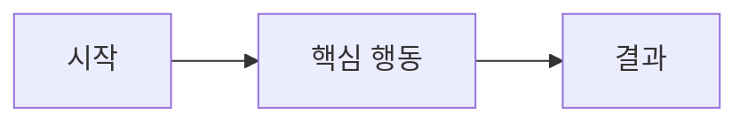

# Design: <!-- 짧은 제목 -->

<!-- 킥오프 K2 산출물. K1 질문 이후에만 작성. 합의 후 내용은 docs/(product.md, architecture.md)로 옮긴다. -->

## Problem / Users

<!-- 누구의 어떤 문제를 푸는가 -->

## Must-have

-

## Later

-

## Journeys

<!-- 주요 사용자 흐름. 아래 Mermaid를 채팅에도 그대로 넣는다. -->

## Stack (사람 선택 · 구현 직전)

<!-- K1에서 이미 고르면 적는다. 아니면 미정. 첫 Implement 전에 번호로 고른 뒤 채운다. -->

- Frontend: 미정
- Backend: 미정
- Database: 미정

## System

- Boundaries:
- Data:
- Integrations:

## UX outline

<!-- 화면이 있을 때만. 없으면 "해당 없음" -->

## Constraints

<!-- 기한, 플랫폼(웹/iOS/Android/CLI/API-only), 배포, 보안, 팀 역량. Stack pick(구현 직전) 선택지 근거 — 언어는 아직 미정 -->

## Out of scope

-

## Open questions

-

## Status

**Draft** | Agreed | Documented (K3)

<!-- 사람 합의 전 문서화·Phase Plan 금지 -->
