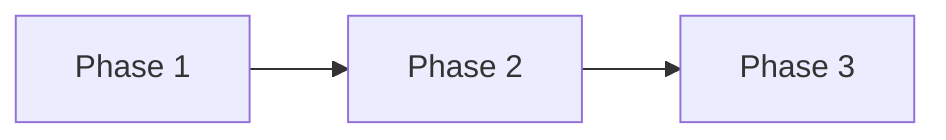

# Plan: <!-- 짧은 제목 -->

<!-- 킥오프 K4에서만 작성. 선행: K1 질문 → K2 전체 설계 합의 → K3 docs. -->

## Goal

<!-- 무엇을 달성하는가 -->

## Scope

- In:
- Out:

## Task Size

Small | Medium | **Large**

## Must-have Features

<!-- 사용자가 꼭 넣겠다고 한 기능. Phase에 모두 매핑한다. -->

| Feature | Phase | Notes |
|---------|-------|-------|
| | | |

## 한눈 그림

<!-- 채팅에도 그대로 넣는다. 노드 제목은 짧게. 화살표 = 진행 순서·의존. -->

## Delivery Phases

<!--
Phase 0(bootstrap)과 별개. 제품 개발은 Phase 1부터.
각 Phase 진행 시 6단계(순서 고정):
1 Explore → 2 Document → 3 Plan(상세·승인) → 4 Implement → 5 Verify(+User Test Guide) → 6 Review → Human Verify
-->

### Phase 1 — <!-- 제목 -->

- Goal:
- In / Out:
- 6-step status:
  - [ ] 1 Explore
  - [ ] 2 Document
  - [ ] 3 Plan (상세) → Human approve
  - [ ] 4 Implement
  - [ ] 5 Verify (AI + User Test Guide)
  - [ ] 6 Review → Human Verify
- Docs to update:
- Changes (files):
- 한눈 그림 (3단계 Plan에서 이 Phase 작업 순서 Mermaid를 채팅에도 넣음):
- AI Verify:
- User Test Guide / 직접 확인 가이드:
  - 실행:
  - 확인:
  - 기대:
  - 실패 시 보고:
- 실행 가이드 (이 Phase 산출물을 켜는 법. 없으면 “실행 대상 없음”):
  - 준비:
  - 실행:
  - 접속:
- 역할 기여 (이 Phase에서 실제로 한 일. 안 쓴 역할은 “해당 없음”):
  - 기획:
  - 설계:
  - 디자인:
  - 개발:
  - QA:
- Human Verify: [ ] 통과 (다음 Phase 전 필수)

### Phase 2 — <!-- 제목 -->

- Goal:
- In / Out:
- 6-step status:
  - [ ] 1 Explore
  - [ ] 2 Document (변경분만)
  - [ ] 3 Plan (상세) → Human approve
  - [ ] 4 Implement
  - [ ] 5 Verify (AI + User Test Guide)
  - [ ] 6 Review → Human Verify
- Docs to update:
- Changes (files):
- 한눈 그림 (3단계 Plan에서 이 Phase 작업 순서 Mermaid를 채팅에도 넣음):
- AI Verify:
- User Test Guide / 직접 확인 가이드:
  - 실행:
  - 확인:
  - 기대:
  - 실패 시 보고:
- 실행 가이드 (이 Phase 산출물을 켜는 법. 없으면 “실행 대상 없음”):
  - 준비:
  - 실행:
  - 접속:
- 역할 기여 (이 Phase에서 실제로 한 일. 안 쓴 역할은 “해당 없음”):
  - 기획:
  - 설계:
  - 디자인:
  - 개발:
  - QA:
- Human Verify: [ ] 통과 (다음 Phase 전 필수)

<!-- 필요 시 Phase N 추가 -->

## Changes (전체 요약)

| File | Change | Why | Phase |
|------|--------|-----|-------|
| | | | |

## Steps

1. 킥오프 K1–K4 후 전체 Plan 승인
2. Phase 1: Explore → Document → Plan → (승인) Implement → Verify → Review → 사람 검수
3. 승인 후 Phase 2도 동일 6단계 …
4. 전체 마무리 Review

## 역할 기여 (전체)

<!-- 마지막 Phase에서 채팅에도 넣는다. 경로·근거만. 안 쓴 역할은 해당 없음. -->

| 역할 | 만든 것 | 어떻게 쓰이는지 |
|------|---------|-----------------|
| 시니어 기획 | | |
| 시니어 설계 | | |
| 시니어 디자인 | | |
| 시니어 개발 | | |
| 시니어 QA | | |

## Verification

- [ ] Phase마다 6단계 완료
- [ ] 관련 테스트 / typecheck / lint / build (해당 시)
- [ ] User Test Guide 제공 (Phase마다)
- [ ] 실행 가이드 제공 (실행 가능한 산출물 · 마지막 Phase 필수)
- [ ] 역할 기여 제공 (마지막 Phase · Plan + 채팅)
- [ ] docs 갱신 (Phase 2 Document)

## Risks

<!-- 보안, 데이터, 호환성, 되돌리기 어려움 -->

## Human Review

- [ ] 요구사항·범위·Must-have ↔ Phase 매핑 확인
- [ ] 아키텍처/보안/데이터 영향 수용
- [ ] 전체 Plan 승인 (Approved 전에 Agent는 Phase 구현 금지)
- [ ] 각 Phase: 상세 Plan 승인 + Human Verify (다음 Phase 전)

## Status

Draft | **Approved** | In Progress (Phase N · step K/6) | Done

<!-- 강제 검사 진실 원천은 Status가 아니라 .cursor/gate.json (채팅 선택→./scripts/gate.sh) -->
