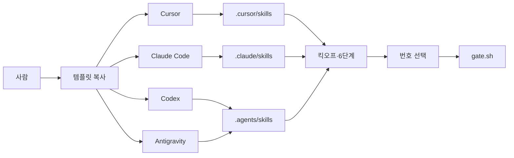

# Design: 멀티 도구에서 같은 프로토콜 쓰기

<!-- 킥오프 K2 산출물. K1 질문 이후에만 작성. 합의 후 내용은 docs/(product.md, architecture.md)로 옮긴다. -->

## Problem / Users

이 템플릿을 복사해 쓰는 사람이 Cursor가 아닌 **Claude Code, Codex, Antigravity**를 열어도, 킥오프·6단계·역할 스킬·게이트를 **같은 방식으로** 쓰고 싶다.

지금 막히는 점: 스킬·훅·클릭 카드가 `.cursor/`에만 있어서, 다른 도구는 `AGENTS.md` 문장만 읽고 스킬을 자동으로 안 붙인다.

## Must-have

- Claude Code, Codex, Antigravity가 **프로젝트 스킬 8개**를 자동으로 읽음 (워크플로 3 + 시니어 역할 5, Cursor와 동일 세트)
- 킥오프 K1–K4, Delivery 6단계, `./scripts/gate.sh` + 채팅 **번호 선택**이 세 도구에서 같음
- 클론·폴더 복사만 하면 됨 (설치 스크립트 없음, 심볼릭 링크 없음)
- 클릭 카드는 **그 도구가 주는 질문 도구가 있을 때만** (없으면 한글 번호)

## Later

- 다른 도구용 쓰기 차단 훅 (Claude Code `PreToolUse` 등)
- 모든 도구에서 클릭 카드 보장
- 스킬 원본 한곳 + 링크/생성 스크립트
- Codex가 `.agents/skills`를 못 찾는 버전만을 위한 `.codex/skills/` 추가 복제 (Human Verify에서 실패할 때만)

## Journeys

글 흐름: 사람 → 템플릿 복사 → 도구별 스킬 폴더 → 킥오프·6단계 → 번호로 승인 → gate.sh

## System

- **스킬 원본:** `.cursor/skills/<name>/SKILL.md` (기존 8개. Cursor가 여기만 본다)
- **복제본 (내용 동일, 실파일, 링크 아님):**
  - `.claude/skills/<name>/` — Claude Code
  - `.agents/skills/<name>/` — Codex와 Antigravity가 같은 경로를 읽음
- **지시 파일:** 루트 `AGENTS.md`(공통), `CLAUDE.md`(Claude Code). 새로 도구별 규칙 파일을 만들지 않음
- **게이트:** `.cursor/gate.json` + `scripts/gate.sh` + `.githooks/pre-commit` (이미 도구 무관). 채팅 선택은 번호가 기본
- **훅:** `.cursor/hooks.json`은 Cursor 전용으로 유지. 다른 도구 훅은 1차 Out
- **Data:** 비밀·사용자 데이터 없음. 스킬 본문이 세 경로에 중복 저장됨
- **Integrations:** 없음 (각 도구의 스킬 디스커버리만)

### 채택 / 기각

- **채택: 실파일 복제.** 다른 PC·Windows에서 클론만으로 동작해야 해서 심볼릭 링크를 쓰지 않음
- **기각: 설치 스크립트.** K1에서 클론·복사만으로 붙이기로 함
- **기각: `.codex/skills/`를 처음부터 추가.** Codex 문서상 레포 경로는 `.agents/skills/`. Antigravity도 동일. 실패하면 Later
- **기각: 워크플로 스킬만 복제.** K1에서 시니어 역할 5개 포함 전부

### 실패 모드

- 한 경로만 고치면 도구마다 프로토콜이 갈라짐 → 가이드에 “세 경로 동일”을 적고, 검증 시 내용 비교
- 도구가 스킬 폴더를 안 읽음 → `AGENTS.md`/`CLAUDE.md`/`guide.md`에 경로를 명시하고, 사람은 번호로 게이트를 진행
- 클릭 카드 없음 → 이미 스킬에 있는 한글 번호 대체. 버그가 아님

## UX outline

해당 없음 (앱 화면 없음). 채팅 UX만: 결정 메뉴는 번호 `1`/`2`/`3`. 도구가 구조화 질문 UI를 주면 그걸 우선.

파일 안내는 “Cursor `Cmd+P`”만이 아니라 **에디터에서 해당 경로를 연다**로 공통 문장을 씀.

## Constraints

- 대상 도구: Cursor, Claude Code, Codex, Antigravity
- 스킬 포맷: 기존 `SKILL.md` + YAML frontmatter 유지 (Agent Skills 공통)
- 구현 전 쓰기 차단은 Cursor 훅만. 다른 도구는 규칙 + git pre-commit
- secret 없음

## Out of scope

- 다른 도구용 파일 쓰기 훅
- 모든 도구에서 AskQuestion/클릭 카드 보장
- 심볼릭 링크, 클론 후 설치 스크립트
- 앱 `src/` 기능
- Cursor Marketplace 플러그인 재패키징
- 게이트 상태 머신 변경 (`gate.sh` 명령 세트 유지)

## Open questions

- Codex 실제 버전이 `.agents/skills`를 안 읽으면 `.codex/skills/` 복제를 Later에서 추가할지 (기본: 실패할 때만)
- 스킬 본문의 “AskQuestion” 이름을 Claude Code `AskUserQuestion`까지 명시할지 (기본: “구조화 질문 도구가 있으면 쓰고, 없으면 번호”)

## Status

Draft | Agreed | **Documented (K3)**

<!-- 사람 합의 전 문서화·Phase Plan 금지 -->
