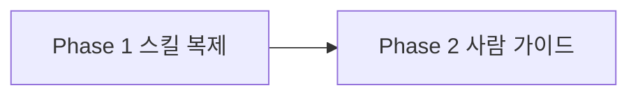
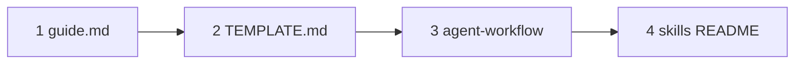

# Plan: 멀티 도구에서 같은 프로토콜 쓰기

<!-- 킥오프 K4에서만 작성. 선행: K1 질문 → K2 전체 설계 합의 → K3 docs. -->

## Goal

Claude Code, Codex, Antigravity에서 이 템플릿을 열면 Cursor와 같이 **스킬 8개가 붙고**, 킥오프·6단계·게이트를 **번호 선택**으로 진행할 수 있게 한다. 클론·복사만으로 동작한다.

## Scope

- In:
  - `.cursor/skills/` 8개를 `.claude/skills/`, `.agents/skills/`에 **실파일로 복제** (링크 없음)
  - 스킬·규칙·가이드 문구를 도구 공통으로 (구조화 질문 UI가 있으면 사용, 없으면 한글 번호; 파일은 에디터에서 경로 열기)
  - `AGENTS.md` / `CLAUDE.md` / `guide.md` / `TEMPLATE.md`에 경로·사용법
  - 세 경로 내용이 같은지 확인하는 검증
- Out:
  - 다른 도구용 쓰기 차단 훅
  - 모든 도구에서 클릭 카드 보장
  - 심볼릭 링크, 클론 후 설치 스크립트
  - `.codex/skills/` (Codex가 `.agents/skills`를 못 읽을 때만 Later)
  - 앱 `src/` , 게이트 상태 머신 변경

## Task Size

Small | Medium | **Large**

## Must-have Features

| Feature | Phase | Notes |
|---------|-------|-------|
| 스킬 8개 자동 로드 (Claude Code / Codex / Antigravity) | 1 | `.claude/skills`, `.agents/skills` 실파일. Codex·Antigravity는 `.agents` 공유 |
| 킥오프·6단계·게이트가 번호 선택으로 같음 | 1 | 기존 스킬 절차 유지. AskQuestion 없으면 번호 (이미 스킬에 있음) |
| 클론·복사만으로 스킬이 보임 | 1 | 링크·설치 스크립트 없음 |
| 클릭 카드는 되는 도구만 | 1 | 문구만 공통. UI 강제 아님 |
| 사람 가이드에 다른 도구 사용법 | 2 | `guide.md` 등. Cursor 전용 문장만 있으면 실패 |

## 한눈 그림

글 흐름: Phase 1 스킬이 세 경로에 붙음 → Phase 2 사람이 다른 도구에서 쓰는 법

## Delivery Phases

<!--
Phase 0(bootstrap)과 별개. 제품 개발은 Phase 1부터.
각 Phase 진행 시 6단계(순서 고정):
1 Explore → 2 Document → 3 Plan(상세·승인) → 4 Implement → 5 Verify(+User Test Guide) → 6 Review → Human Verify
-->

### Phase 1 — 스킬 복제와 공통 문구

- Goal: 세 도구가 같은 스킬 8개를 읽고, 결정 메뉴는 번호(가능하면 클릭 카드)로 동작한다.
- In / Out:
  - In: `.claude/skills/`, `.agents/skills/`에 8개 복사. 스킬 본문에서 Cursor 전용 문장(예: Cmd+P만, AskQuestion만)을 **도구 공통**으로 최소 수정. `AGENTS.md`/`CLAUDE.md`에 스킬 경로 한 줄.
  - Out: `guide.md` 본문 개편(Phase 2). 훅. `.codex/skills/`.
- 6-step status:
  - [x] 1 Explore
  - [x] 2 Document
  - [x] 3 Plan (상세) → Human approve
  - [x] 4 Implement
  - [x] 5 Verify (AI + User Test Guide)
  - [x] 6 Review → Human Verify
- Docs to update: `docs/architecture.md` 경로가 실제 폴더와 맞는지 확인(변경분이 있을 때만)
- Changes (files): `.claude/skills/**`, `.agents/skills/**`, `.cursor/skills/**`(공통 문구), `AGENTS.md`, `CLAUDE.md`
- 한눈 그림 (3단계 Plan에서 이 Phase 작업 순서 Mermaid를 채팅에도 넣음):

- **상세 순서 (승인 후 Implement):**
  1. `.cursor/skills`만 먼저 고친다. 규칙: 구조화 질문 도구가 있으면 쓰고 없으면 한글 번호(기존 유지). “Cursor에서 연다 / Cmd+P만” → “에디터에서 경로를 연다 (Cursor는 Cmd+P / Ctrl+P)”. 대상: `project-kickoff`, `delivery-phase`, `phase-gate`, `senior-pm` (필요 시 `senior-architect` / `senior-qa` 한 줄). 훅·게이트 로직 문구는 바꾸지 않음.
  2. 스킬 폴더 8개를 실파일로 복사 (`cp -R`, 링크 아님):  
     `project-kickoff`, `delivery-phase`, `phase-gate`, `senior-architect`, `senior-pm`, `senior-design`, `senior-dev`, `senior-qa`  
     → `.claude/skills/<name>/`, `.agents/skills/<name>/`  
     `README.md`는 Phase 2.
  3. `AGENTS.md`, `CLAUDE.md`에 세 경로를 한 줄로 명시. 내용은 같게 유지하라고 적음.
  4. 구현 후 Verify: 8개 각각 `diff -rq`로 세 트리가 같음. `.claude`·`.agents`에 README 없음. 두 지시 파일에 경로 문자열이 있음.
- 하지 않음: `guide.md`, 훅, `.codex/skills/`, 설치 스크립트, 심볼릭 링크.
- AI Verify: 세 트리의 `SKILL.md` 목록이 같고, 워크플로 스킬에 번호 대체 문구가 있음. `*.mdc` 아닌 스킬 파일만.
- User Test Guide / 직접 확인 가이드:
  - 실행: 레포에서 `.claude/skills`와 `.agents/skills` 폴더가 보이는지 확인
  - 확인: 각 폴더에 워크플로 3 + 시니어 5가 있는지. Claude Code/Codex/Antigravity가 있으면 그 도구에서 스킬 목록에 이름이 보이는지
  - 기대: Cursor와 같은 8개 이름. 클릭 카드가 없으면 한글 번호가 나옴
  - 실패 시 보고: 빠진 폴더·이름, 도구가 스킬을 못 찾는 메시지
- 실행 가이드 (이 Phase 산출물을 켜는 법. 없으면 “실행 대상 없음”):
  - 준비: 해당 AI 도구로 이 폴더를 연다
  - 실행: 실행 대상 없음 (앱 서버 없음)
  - 접속: 해당 도구의 Agent/Chat
- 역할 기여 (이 Phase에서 실제로 한 일. 안 쓴 역할은 “해당 없음”):
  - 기획:
  - 설계:
  - 디자인: 해당 없음
  - 개발:
  - QA:
- Human Verify: [x] 통과 (다음 Phase 전 필수)

### Phase 2 — 사람 가이드

- Goal: Cursor가 아닌 도구에서도 `guide.md`만 보고 같은 방식으로 승인·진행할 수 있다.
- In / Out:
  - In: `guide.md`에 다른 도구 절(번호 선택 기본, 스킬 경로, 훅은 Cursor만). `TEMPLATE.md`, `.cursor/skills/README.md`, `docs/ai/agent-workflow.md` 경로 표. Phase 1과 파일이 어긋나면 맞춤.
  - Out: 훅 구현. 클릭 카드 강제. 새 도구 추가.
- 6-step status:
  - [x] 1 Explore
  - [x] 2 Document (변경분만)
  - [x] 3 Plan (상세) → Human approve
  - [x] 4 Implement
  - [x] 5 Verify (AI + User Test Guide)
  - [x] 6 Review → Human Verify
- Docs to update: `guide.md`, `TEMPLATE.md`, `docs/ai/agent-workflow.md`, `docs/README.md`(상태)
- Changes (files): 위 docs + skills README
- 한눈 그림 (3단계 Plan에서 이 Phase 작업 순서 Mermaid를 채팅에도 넣음):

- **상세 순서 (승인 후 Implement):**
  1. `guide.md`
     - 서론: Cursor만이 아니라 Claude Code / Codex / Antigravity에서도 같은 프로토콜
     - §1: 도구별 스킬 경로 표 (`.cursor/skills`, `.claude/skills`, `.agents/skills`). 훅은 Cursor만. 클론만 하면 됨
     - 「선택 UI가 버튼으로 안 보일 때」: Cursor는 모델 변경. **다른 도구는 한글 번호가 기본**. 가짜 버튼 없음
     - 파일 열기: “에디터에서 경로” (Cursor는 Cmd+P). AskQuestion 프롬프트 예시도 같이
     - §9 한 줄 요약: 버튼 우선은 Cursor, 그 외는 번호
     - 전 파일을 다시 쓰지 않음. Cursor 전용 문장만 최소 수정 + 짧은 다른 도구 절
  2. `TEMPLATE.md`: Skills 행에 세 경로. 첫 문단을 도구 공통으로
  3. `docs/ai/agent-workflow.md`: Skills 축·AskQuestion 문구를 호스트 도구 + 번호 대체. “한 Cursor Agent” → “한 Agent 채팅”
  4. `.cursor/skills/README.md`: 제목을 Cursor-only에서 빼고 세 경로 명시. README는 `.cursor`에만 둠 (Phase 1과 동일)
  5. `docs/README.md` 상태 한 줄. `docs/architecture.md`의 “아직 Cursor만” 표를 Implement 후 현재 상태로 맞춤
  6. 하지 않음: 훅, `.codex/skills/`, 스킬 본문 재복제(Phase 1에서 끝), 클릭 카드 강제
- AI Verify: `guide.md`에 `Claude Code`, `Codex`, `Antigravity`, `.claude/skills`, `.agents/skills`가 실제로 있음. `TEMPLATE.md`와 `agent-workflow.md`에 `.agents/skills` 또는 세 도구 이름 중 하나 이상.
- AI Verify: `guide.md`에 Claude Code / Codex / Antigravity와 `.claude/skills` / `.agents/skills`가 실제로 적혀 있음
- User Test Guide / 직접 확인 가이드:
  - 실행: `guide.md` §1 근처와 새 절을 연다
  - 확인: 다른 컴퓨터에서 Claude/Codex/Antigravity로 열 때 무엇을 하면 되는지, 버튼이 없을 때 `1`/`2`/`3`인지가 적혀 있는지
  - 기대: Cursor 전용 설정(모델 바꾸기)과 별도로, 다른 도구 경로가 나옴
  - 실패 시 보고: 빠진 도구 이름, Cursor만 하라는 문장만 있는 절
- 실행 가이드:
  - 준비: 해당 도구로 폴더를 연다
  - 실행: 실행 대상 없음
  - 접속: `guide.md`
- 역할 기여:
  - 기획:
  - 설계:
  - 디자인: 해당 없음
  - 개발:
  - QA:
- Human Verify: [x] 통과 (다음 Phase 전 필수)

## Changes (전체 요약)

| File | Change | Why | Phase |
|------|--------|-----|-------|
| `.claude/skills/**` | 8개 스킬 실파일 추가 | Claude Code 디스커버리 | 1 |
| `.agents/skills/**` | 8개 스킬 실파일 추가 | Codex·Antigravity 디스커버리 | 1 |
| `.cursor/skills/**` | 결정 UI·파일 열기 문구를 도구 공통으로 | 복제본과 원본이 같은 프로토콜 | 1 |
| `AGENTS.md`, `CLAUDE.md` | 스킬 경로 명시 | 도구가 폴더를 못 찾을 때 사람이 알 수 있게 | 1 |
| `guide.md`, `TEMPLATE.md`, `docs/ai/agent-workflow.md` | 다른 도구 사용법 | 사람이 같은 방식으로 쓰게 | 2 |

## Steps

1. 킥오프 K1–K4 후 전체 Plan 승인
2. Phase 1: Explore → Document → Plan → (승인) Implement → Verify → Review → 사람 검수
3. 승인 후 Phase 2도 동일 6단계 …
4. 전체 마무리 Review

## 역할 기여 (전체)

<!-- 마지막 Phase에서 채팅에도 넣는다. 경로·근거만. 안 쓴 역할은 해당 없음. -->

| 역할 | 만든 것 | 어떻게 쓰이는지 |
|------|---------|-----------------|
| 시니어 기획 | 멀티 도구 In/Out, Phase 1 스킬·Phase 2 가이드 분할, `guide.md` §1 도구 표 | 사람이 번호로 승인하고 다른 도구에서 같은 순서를 씀 |
| 시니어 설계 | `.cursor/plans/multi-tool-skills-design.md`, `docs/architecture.md` 세 경로 | 스킬 원본/복제 위치와 훅 Out을 정함 |
| 시니어 디자인 | 해당 없음 | |
| 시니어 개발 | `.claude/skills/`, `.agents/skills/`, `AGENTS.md`, `CLAUDE.md`, `guide.md`, `TEMPLATE.md` | 클론만 하면 도구가 스킬을 읽고 사람이 가이드를 봄 |
| 시니어 QA | 세 트리 `diff -rq`, Phase 1·2 직접 확인 가이드 | 복사 일치와 guide에 도구 이름이 있는지 검사 |

## Verification

- [ ] Phase마다 6단계 완료
- [ ] 관련 테스트 / typecheck / lint / build (해당 시)
- [ ] User Test Guide 제공 (Phase마다)
- [ ] 실행 가이드 제공 (실행 가능한 산출물 · 마지막 Phase 필수)
- [ ] 역할 기여 제공 (마지막 Phase · Plan + 채팅)
- [ ] docs 갱신 (Phase 2 Document)

## Risks

- 세 경로 중 하나만 고치면 도구마다 프로토콜이 갈라짐
- Codex 버전이 `.agents/skills`를 안 읽으면 Phase 1 Human Verify 실패 → Later로 `.codex/skills/` 검토
- Windows에서 실파일 복제는 문제 없음 (링크를 쓰지 않음)
- Cursor 훅이 없는 도구에서는 구현 전 쓰기를 규칙만으로 막음 (1차 수용)

## Human Review

- [ ] 요구사항·범위·Must-have ↔ Phase 매핑 확인
- [ ] 아키텍처/보안/데이터 영향 수용
- [ ] 전체 Plan 승인 (Approved 전에 Agent는 Phase 구현 금지)
- [ ] 각 Phase: 상세 Plan 승인 + Human Verify (다음 Phase 전)

## Status

**Draft** | Approved | In Progress (Phase N · step K/6) | Done

<!-- 강제 검사 진실 원천은 Status가 아니라 .cursor/gate.json (채팅 선택→./scripts/gate.sh) -->
