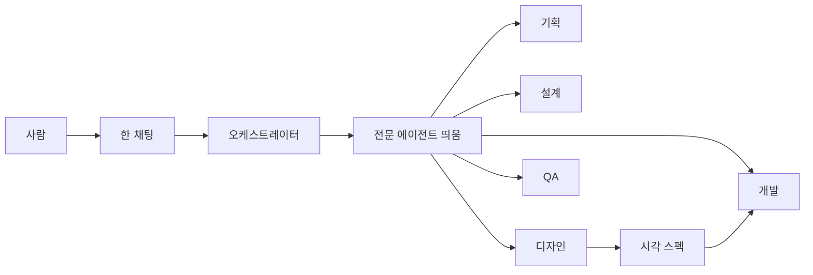

# Design: 단계별 전문 에이전트

<!-- 킥오프 K2 산출물. K1 질문 이후에만 작성. 합의 후 내용은 docs/(product.md, architecture.md)로 옮긴다. -->

## Problem / Users

이 템플릿으로 프로젝트를 만드는 사람. 지금은 **한 Agent가 역할 Skill만 바꿔** 기획·디자인·개발·QA를 한다. 완료 화면을 보고 “디자이너 에이전트가 한 거냐”, “기획은 기획 에이전트가 한 거냐”고 물으면 **아니다**가 맞다.

원하는 것: 기획할 때 **기획 에이전트**, 디자인할 때 **디자인 에이전트**, 개발할 때 **개발 에이전트**, 검수할 때 **QA 에이전트**가 그 본문을 전문적으로 쓴다. 사람은 채팅을 여러 개 열지 않는다.

## Must-have

- 사람은 **채팅 하나**. 단계가 되면 **오케스트레이터**가 해당 전문 에이전트를 **자동으로 띄운다**
- 전문 에이전트 다섯: **기획 / 설계 / 디자인 / 개발 / QA**
- 오케스트레이터는 **단계 전환과 게이트만**. 기획·설계·디자인·코드·검수 **본문은 해당 에이전트만** 쓴다
- Cursor, Claude Code, Codex, Antigravity에서 **사람 경험은 같게** (한 창, 같은 단계, 같은 승인)
- 킥오프 K1–K4, Phase 6단계, 사람 승인·`gate.sh`는 **유지**. 바꾸는 것은 실행자뿐
- 화면이 있는 Phase는 **Plan(구현 승인 전)** 에 디자인 에이전트가 시각 스펙을 낸다. 개발 에이전트는 그걸 따른다. UI 없으면 디자인 에이전트는 건너뛴다

## Later

- 역할마다 다른 모델 고정
- Cursor Marketplace 다중 봇
- 도구별 쓰기 차단 훅을 전문 에이전트 권한과 맞추기
- 서브에이전트 API가 없는 모델에서도 프로세스 수준 격리 (지금은 Isolation Pass)

## Journeys

글 흐름: 사람 → 오케스트레이터(단계·게이트) → 해당 전문 에이전트 → 산출물 → 사람 승인

## System

- **오케스트레이터 (부모 세션):** 기존 워크플로 Skill `project-kickoff` / `delivery-phase` / `phase-gate`. 사람 선택 후에만 mutating `gate.sh`. `gate.json` 직접 수정 금지.
- **전문 에이전트 (자식 세션):** 호스트가 제공하는 **커스텀 서브에이전트**. 각자 컨텍스트. 대화 전체를 공유하지 않음. 입력은 오케스트레이터가 프롬프트로 넘긴다.
- **Quality bar 원본:** 기존 `senior-*` Skill (세 경로 동일 유지). 에이전트 파일은 **얇은 래퍼** — Skill을 읽고 따르며, 격리·도구·금지(게이트 본문 작성 금지)만 추가. Quality bar를 네 번째 복사본으로 늘리지 않음.

### 에이전트 파일 위치 (도구가 실제로 읽는 곳, 실파일 복제, 링크 아님)

| 도구 | 경로 | 형식 |
|------|------|------|
| Cursor | `.cursor/agents/<name>.md` | Markdown + YAML |
| Claude Code | `.claude/agents/<name>.md` | Markdown + YAML |
| Antigravity | `.agents/agents/<name>.md` | Markdown + YAML |
| Codex | `.codex/agents/<name>.toml` | TOML (`name` / `description` / `developer_instructions`) |

이름 (다섯): `senior-pm`, `senior-architect`, `senior-design`, `senior-dev`, `senior-qa`.

### 단계 → 띄울 에이전트 (순차. 한 단계에 여러 명이면 앞에서 뒤로)

| 단계 | 전문 에이전트 |
|------|----------------|
| K1 | 기획 |
| K2 | 기획 → 설계 → (제품 UI면) 디자인 |
| K3 | 기획(`docs/product.md`) → 설계(`docs/architecture.md` 등) |
| K4 | 기획 → 설계 |
| Explore | 설계 |
| Document | 문서 성격에 따라 설계 또는 기획 |
| Plan | 기획 → (UI면) 디자인 |
| Implement | 개발 (디자인 스펙 준수. 룩을 새로 만들지 않음) |
| Verify | QA |
| Review | QA → 설계 |

사용자 명시 호출(`시니어 QA로만` 등)이 있으면 그 에이전트만 띄운다.

### 호스트 어댑터

오케스트레이터는 **이 턴에 본문을 쓰지 않고** 아래 순서로 띄운다.

1. **네이티브 spawn이 있으면 반드시 사용**
   - Cursor: 커스텀 서브에이전트 / Task (`subagent_type` = 에이전트 `name`)
   - Claude Code: `.claude/agents/` 위임
   - Codex: `.codex/agents/` spawn
   - Antigravity: `invoke_subagent` (`.agents/agents/`, `subagent: true`)
2. **spawn API가 없으면 Isolation Pass** (사람 경험은 같게 유지하는 최저선)
   - 채팅에 `▶ 전문 에이전트 시작: 시니어 ○○` / `▶ 종료`
   - 그 구간에선 해당 Skill만. 오케스트레이터 목소리로 기획·코드를 섞지 않음
   - 실패: spawn을 건너뛰고 한 응답에서 기획+디자인+구현을 같이 쓰는 것

### 채택 / 기각

- **채택: 네이티브 서브에이전트 + 호스트별 에이전트 파일.** 네 도구 모두 커스텀 에이전트 경로가 있음. 스킬만 바꾸는 현재 방식은 문제(같은 봇)를 풀지 못함.
- **채택: Skill은 Quality bar, Agent는 격리·띄우기.** 본문 중복을 늘리지 않음. 스킬 세 경로 복제 패턴은 유지.
- **채택: Isolation Pass를 공식 폴백.** “도구마다 사람 경험이 같아야”와 “Codex/일부 모델은 Task가 없을 수 있음”을 같이 만족. 프로세스 격리는 Later.
- **기각: 사람이 채팅을 역할마다 따로 열기.** K1에서 오케스트레이터(한 창)를 고름.
- **기각: 단계 이름을 기획→디자인→개발→QA로 재구성.** K1에서 6단계·게이트 유지.
- **기각: 오케스트레이터가 초안을 쓰고 전문 에이전트는 검수만.** K1에서 본문은 전문 에이전트만.

### 실패 모드

- 오케스트레이터가 spawn 없이 본문을 씀 → 워크플로 Skill에 **금지 + 실패 조건**을 명시. 가이드 FAQ에 “디자이너가 했냐”의 정답을 바꿈
- 에이전트 파일만 고치고 Skill은 안 고침 → Quality bar가 갈라짐. 에이전트는 Skill을 읽게 함
- 한 호스트 경로만 추가 → 그 도구만 전문 에이전트가 없음. 검증 시 네 경로 존재 확인
- Cursor에서 `.codex/agents/` Markdown과 Codex TOML이 충돌 → Codex는 `.codex/` TOML만, Cursor는 `.cursor/agents/`만 씀
- 서브에이전트가 대화 이력을 못 봄 → 오케스트레이터가 **입력 패키지**(관련 docs/plan 경로, 이전 산출물, 이번 단계 In/Out)를 프롬프트에 넣음

### Blast radius

- **In:** `project-kickoff`, `delivery-phase`, `phase-gate`(spawn 금지 명시), `guide.md` §2-2, `docs/ai/agent-workflow.md`, `AGENTS.md`/`TEMPLATE.md`/`CLAUDE.md`, skills README, 신규 `agents` 파일들, 기존 `senior-*`에 “너는 떠워진 전문가이지 오케스트레이터가 아니다”
- **Out:** 앱 `src/`, `gate.sh` 의미 변경, 6단계 이름, Marketplace 봇, 역할별 모델 강제

## UX outline

앱 화면 없음. **채팅 UX만.**

- 사람은 창 하나. 전문 에이전트 창을 고르지 않음
- 단계가 바뀌면 오케스트레이터가 해당 에이전트를 띄운 뒤, 산출물을 이 채팅에 보여 줌 (서브에이전트 UI 또는 Isolation Pass 배너)
- 한눈 그림·지금 볼 곳·선택 UI는 **오케스트레이터**가 전문 산출물 **다음에** 붙임. 전문 에이전트는 `gate.sh`를 돌리지 않음
- Plan(UI): 기획 산출물 → 디자인 시각 스펙 → **한 번의** 구현 승인 메뉴
- “이 화면을 디자이너가 했나?” → 예: Plan에서 디자인 에이전트가 스펙을 냈고, 개발 에이전트가 그걸 구현함

## Constraints

- 대상 도구: Cursor, Claude Code, Codex, Antigravity. 설치 스크립트·심볼릭 링크 없음 (기존 템플릿과 같음)
- 게이트·훅 의미는 유지. 전문 에이전트도 `gate.json` 직접 수정 금지. mutating `gate.sh`는 사람 선택 후 오케스트레이터만
- 시크릿/`.env` 실제 값 금지 (모든 에이전트)
- Cursor Task가 모델/세션에 없을 수 있음 → Isolation Pass
- 이 레포의 현재 `gate.json`은 **다른** Large 작업 중일 수 있음. 이 설계를 구현할 때는 **새 Phase Plan 승인 후** 진행 (기존 게이트를 임의로 덮지 않음)

## Out of scope

- 사람이 기획/디자인/개발/QA 채팅을 각각 여는 것을 **필수 UX**로 만들기
- Marketplace / 별도 프로세스 오케스트레이터 제품
- Delivery 단계 이름을 역할명으로 바꾸기
- 앱 기능(`src/`) 구현
- 역할마다 다른 LLM 강제
- 역할마다 다른 git 워크트리 강제

## Open questions

- Isolation Pass를 “같음”으로 볼지, 사용자 테스트에서 “진짜 서브에이전트가 안 뜨면 실패”로 볼지. **기본: 네이티브 spawn 성공이 통과, Isolation Pass는 해당 도구/모델에서 spawn이 없을 때만 허용하고 가이드에 밝힘**
- Antigravity 에이전트 frontmatter(`subagent: true` 등) 최소 필드. 구현 시 문서 기준으로 채움
- Codex TOML에 Skill 경로를 어떻게 넣을지 (`developer_instructions`에 “`.agents/skills/senior-pm/SKILL.md`를 읽고 따르라”)

## Status

Draft | Agreed | **Documented (K3)**

<!-- 사람 합의 전 문서화·Phase Plan 금지 -->
