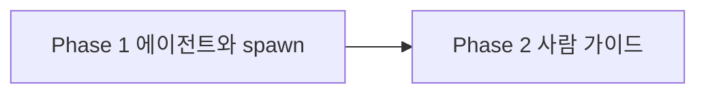
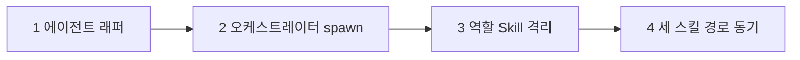
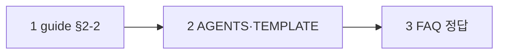

# Plan: 단계별 전문 에이전트

<!-- 킥오프 K4에서만 작성. 선행: K1 질문 → K2 전체 설계 합의 → K3 docs. -->

## Goal

이 템플릿으로 프로젝트를 만들 때, 사람은 **채팅 하나**만 쓰고, 기획·설계·디자인·개발·QA **본문은 각각 전문 에이전트**가 쓰게 한다. 오케스트레이터는 단계·게이트만 한다.

## Scope

- In:
  - 전문 에이전트 다섯 정의 파일 (호스트별 경로, 실파일, 링크 없음)
  - `project-kickoff` / `delivery-phase`: spawn 의무, 오케스트레이터 본문 금지, Plan에서 UI면 디자인 에이전트
  - `senior-*`: “떠워진 전문가이지 오케스트레이터가 아니다”
  - `guide.md` 등 사람 문구: “한 Agent가 관점만 교체” → “오케스트레이터가 전문 에이전트를 띄움”
  - Isolation Pass (spawn API 없을 때)
- Out:
  - 사람이 역할마다 채팅을 따로 여는 필수 UX
  - Marketplace 봇, 역할별 모델 강제, 단계 이름 변경
  - 게이트 상태 머신 의미 변경, 앱 `src/`
  - 심볼릭 링크, 설치 스크립트

## Task Size

Small | Medium | **Large**

## Must-have Features

| Feature | Phase | Notes |
|---------|-------|-------|
| 한 채팅 + 단계마다 전문 에이전트 자동 spawn | 1 | 오케스트레이터는 본문을 쓰지 않음 |
| 에이전트 다섯 (기획/설계/디자인/개발/QA) | 1 | 네 호스트 경로에 실파일 |
| Cursor / Claude Code / Codex / Antigravity에서 같은 사람 경험 | 1 | 네이티브 spawn, 없으면 Isolation Pass |
| K1–K4 · 6단계 · gate.sh 유지 | 1 | 매핑만 “누가 쓰나”로 바꿈 |
| Plan(구현 승인 전)에 디자인 시각 스펙 | 1 | UI 없으면 디자인 에이전트 건너뜀 |
| 사람 가이드·FAQ (“디자이너가 했나?” → 예) | 2 | `guide.md` §2-2 등 |

## 한눈 그림

글 흐름: Phase 1에서 전문 에이전트가 실제로 뜨게 함 → Phase 2에서 사람이 그 방식으로 이해하게 함

## Delivery Phases

### Phase 1 — 에이전트 정의와 오케스트레이터 spawn

- Goal: 다섯 전문 에이전트 파일이 네 도구 경로에 있고, 킥오프·Delivery 단계에서 오케스트레이터가 본문을 쓰지 않고 해당 에이전트를 띄운다 (또는 Isolation Pass).
- In / Out:
  - In: `.cursor/agents/*.md`, `.claude/agents/*.md`, `.agents/agents/*.md`, `.codex/agents/*.toml` (이름: `senior-pm` 등 다섯). `project-kickoff` / `delivery-phase` / `phase-gate` spawn 프로토콜. `senior-*`에 전문가 격리 문단. 세 스킬 경로 내용 동일.
  - Out: `guide.md` 전면(Phase 2). 게이트 CLI 변경. Marketplace. `src/`.
- 6-step status:
  - [x] 1 Explore
  - [x] 2 Document
  - [x] 3 Plan (상세) → Human approve
  - [x] 4 Implement
  - [x] 5 Verify (AI + User Test Guide)
  - [ ] 6 Review (사람 선택으로 next-phase, Review 생략)
- Human Verify: [x] 통과 (다음 Phase 전 필수)
- Changes (files): `.cursor/agents/`, `.claude/agents/`, `.agents/agents/`, `.codex/agents/`, `.cursor/skills/project-kickoff`, `delivery-phase`, `phase-gate`, `senior-*` (+ `.claude/skills/`, `.agents/skills/` 동일)
- 한눈 그림 (3단계 Plan에서 이 Phase 작업 순서 Mermaid를 채팅에도 넣음):

- **상세 순서 (승인 후 Implement):**
  1. **에이전트 래퍼 다섯** (Quality bar는 Skill을 읽게 함. 본문 복제 금지)
     - 공통 이름: `senior-pm`, `senior-architect`, `senior-design`, `senior-dev`, `senior-qa`
     - Cursor: `.cursor/agents/<name>.md` — YAML `name`, `description`(오케스트레이터가 해당 단계에서 **반드시** 위임), `model: inherit`
     - Claude Code: `.claude/agents/<name>.md` — 같은 본문
     - Antigravity: `.agents/agents/<name>.md` — 같은 본문 + `subagent: true`, `mainAgent: false`
     - Codex: `.codex/agents/<name>.toml` — `name`, `description`, `developer_instructions` (`.agents/skills/<name>/SKILL.md`를 읽고 따르라)
     - 본문 공통: 떠워진 전문가이지 오케스트레이터가 아님. mutating `gate.sh`·`gate.json` 직접 수정 금지. 다른 역할 산출물을 이 턴에 쓰지 않음. 첫 줄 `역할: 시니어 ○○`.
  2. **`delivery-phase`** — Role map을 “이 에이전트를 띄움”으로. Plan+UI면 기획 다음 디자인. **Specialist launch:** 오케스트레이터는 본문 금지. Cursor Task/`subagent_type`, Claude 위임, Codex spawn, Antigravity `invoke_subagent`. 불가 시 Isolation Pass 배너. 입력 패키지(docs/plan 경로·이전 산출물·In/Out). 한눈 그림·AskQuestion·`gate.sh`는 오케스트레이터만.
  3. **`project-kickoff`** — K1 기획, K2 기획→설계→(UI면)디자인, K3·K4 기획→설계. 같은 launch 규칙.
  4. **`phase-gate`** — mutating `gate.sh`는 오케스트레이터만.
  5. **`senior-*`** — “너는 spawn된 전문가. 오케스트레이터 흉내 금지” 한 블록. Quality bar 유지.
  6. **세 스킬 경로 동기** — `.cursor/skills/` 변경분을 `.claude/skills/`, `.agents/skills/`에 실파일 복사. README·`guide.md`는 Phase 2.
  7. 하지 않음: `guide.md` 전면, 게이트 CLI, `src/`, 심볼릭 링크.
- AI Verify: 다섯 이름이 네 경로에 있음. 워크플로 스킬에 spawn/Isolation Pass/본문 금지 문구. 만진 `SKILL.md` 세 트리 diff.
- User Test Guide / 직접 확인 가이드:
  - 실행: 에디터에서 `.cursor/agents/` (및 `.claude/agents/`, `.agents/agents/`, `.codex/agents/`)를 연다
  - 확인: 다섯 파일 이름. 새 Agent 채팅에서 UI가 있는 작업의 Plan을 요청했을 때, 오케스트레이터가 기획·디자인 **본문을 직접 쓰지 않고** 에이전트를 띄우거나 `▶ 전문 에이전트 시작` 배너가 보이는지
  - 기대: 기획 산출물과 (UI면) 시각 스펙이 전문 에이전트 구간에서 나옴. 한 응답에 기획+디자인+코드를 오케스트레이터가 섞지 않음
  - 실패 시 보고: 빠진 파일, spawn 없이 본문을 쓴 채팅 붙여넣기
- 실행 가이드:
  - 준비: Cursor / Claude Code / Codex / Antigravity로 이 폴더를 연다
  - 실행: 실행 대상 없음 (앱 서버 없음)
  - 접속: 해당 도구의 Agent/Chat
- 역할 기여:
  - 기획: 킥오프 K1–K4, `.cursor/plans/specialist-agents.md` Phase 분할
  - 설계: `docs/architecture.md`, 호스트별 에이전트 경로
  - 디자인: 해당 없음 (앱 UI 없음. 에이전트 정의는 개발)
  - 개발: `.cursor/agents/` 등 네 경로, `delivery-phase` Specialist launch
  - QA: Phase 1 파일 존재·스킬 동기 검증
- Human Verify: [x] 통과 (다음 Phase 전 필수)

### Phase 2 — 사람 가이드와 FAQ

- Goal: `guide.md`만 보고도 “기획은 기획 에이전트, 디자인은 디자인 에이전트”로 이해하고, “이 화면을 디자이너가 했나?”의 정답이 **예(Plan에서 디자인 에이전트)** 가 되게 한다.
- In / Out:
  - In: `guide.md` §2-2, `TEMPLATE.md`, `AGENTS.md`, `CLAUDE.md`, `.cursor/skills/README.md`, `docs/ai/agent-workflow.md` 잔여 문구. Phase 1과 어긋나면 맞춤.
  - Out: 훅 구현. 클릭 카드 강제. 게이트 상태 머신 변경.
- 6-step status:
  - [x] 1 Explore
  - [x] 2 Document (변경분만)
  - [x] 3 Plan (상세) → Human approve
  - [x] 4 Implement
  - [x] 5 Verify (AI + User Test Guide)
  - [ ] 6 Review → Human Verify
- Docs to update: `guide.md`, `TEMPLATE.md`, `docs/ai/agent-workflow.md`, `docs/README.md`(상태)
- Changes (files): 위 + `AGENTS.md` / `CLAUDE.md` / skills README / `.cursor/rules/01-agent-workflow.mdc` 「역할」
- 한눈 그림:

- **상세 순서 (승인 후 Implement):**
  1. `guide.md` §2-2 제목·본문: 한 채팅, 오케스트레이터가 전문 에이전트를 띄움. Skill은 Quality bar. 6단계 표를 Phase 1 Role map(띄울 에이전트)과 맞춤. §2-3 명시 호출 = 그 에이전트만 spawn.
  2. FAQ 추가: “디자이너 에이전트가 했나?” → UI Phase면 Plan에서 디자인 에이전트 스펙 + 개발 구현. “기획 에이전트가 했나?” → K1·Plan에서 기획 에이전트. Isolation Pass(배너)도 그 역할의 작업으로 본다.
  3. `TEMPLATE.md` “한 Agent Chat · 관점” 문장을 오케스트레이터+전문 에이전트로.
  4. `AGENTS.md` / `CLAUDE.md`: Role map을 따르면 spawn. Quality bar는 Skill.
  5. `.cursor/skills/README.md`, `.cursor/rules/01-agent-workflow.mdc` 「역할」.
  6. `docs/ai/agent-workflow.md`에 남은 옛 문장만 맞춤. `docs/README.md` 상태.
  7. 하지 않음: 에이전트 파일 재작성, 게이트 CLI, `src/`.
- AI Verify: `guide.md` / `AGENTS.md` / skills README에 “관점만 교체”·“다중 봇이 아님”이 **옛 의미로** 없음. “오케스트레이터가 전문 에이전트를 띄움”이 있음.
- User Test Guide / 직접 확인 가이드:
  - 실행: `guide.md` §2-2를 에디터에서 연다
  - 확인: 한 창, 다섯 에이전트, 오케스트레이터는 게이트만. FAQ에 디자이너/기획자 질문이 새 정답으로 있는지
  - 기대: 이전처럼 “같은 Agent가 Skill만 바꿨다”고 안내하지 않음
  - 실패 시 보고: 남은 옛 문장, 경로
- 실행 가이드:
  - 준비: 이 폴더를 연다
  - 실행: 실행 대상 없음
  - 접속: `guide.md`
- 역할 기여:
  - 기획:
  - 설계:
  - 디자인: 해당 없음
  - 개발:
  - QA:
- Human Verify: [ ] 통과 (다음 Phase 전 필수)

## Changes (전체 요약)

| File | Change | Why | Phase |
|------|--------|-----|-------|
| `.cursor/agents/*.md` 등 네 경로 | 전문 에이전트 다섯 | 호스트가 실제로 띄움 | 1 |
| `project-kickoff` / `delivery-phase` / `phase-gate` | spawn 의무, 본문 금지 | 같은 봇이 전부 쓰는 것 방지 | 1 |
| `senior-*` Skill | 전문가 격리 문단 | Quality bar는 Skill, 실행은 에이전트 | 1 |
| `guide.md` 등 | §2-2·FAQ | 사람 이해가 동작과 같게 | 2 |

## Steps

1. 킥오프 K1–K4 후 전체 Plan 승인
2. Phase 1: Explore → Document → Plan → (승인) Implement → Verify → Review → 사람 검수
3. 승인 후 Phase 2도 동일 6단계
4. 전체 마무리 Review

## 역할 기여 (전체)

| 역할 | 만든 것 | 어떻게 쓰이는지 |
|------|---------|-----------------|
| 시니어 기획 | 킥오프 K1–K4, `.cursor/plans/specialist-agents.md`, `guide.md` FAQ | 범위·단계 분할·사람 질문의 정답 |
| 시니어 설계 | `docs/architecture.md`, 호스트별 에이전트 경로 | spawn 위치와 Isolation Pass |
| 시니어 디자인 | 해당 없음 | 앱 UI 없음 |
| 시니어 개발 | `.cursor/agents/` 등, `delivery-phase` Specialist launch, `guide.md` §2-2 | 전문 에이전트가 본문을 쓰게 함 |
| 시니어 QA | Phase 1 파일 검증, Phase 2 문구 grep | 직접 확인 가이드 |

킥오프: K1 질문 · K2 `.cursor/plans/specialist-agents-design.md` · K3 `docs/product.md` 등 · K4 이 파일.

## Verification

- [ ] Phase마다 6단계 완료
- [ ] 관련 테스트 / typecheck / lint / build (해당 시)
- [ ] User Test Guide 제공 (Phase마다)
- [ ] 실행 가이드 제공 (실행 가능한 산출물 · 마지막 Phase 필수)
- [ ] 역할 기여 제공 (마지막 Phase · Plan + 채팅)
- [ ] docs 갱신 (Phase 2 Document)

## Risks

- Cursor 일부 모델/세션에 Task가 없으면 Isolation Pass로만 동작. 프로세스 격리는 Later. 가이드에 밝힘.
- Codex TOML vs Cursor `.codex/agents/` Markdown 충돌 → Cursor는 `.cursor/agents/`만, Codex는 `.codex/agents/` TOML만.
- **이전 Large가 `gate.json` phase=3에 남아 있음.** `approve-plan`은 `step=explore`만 넣고 `phase`는 안 돌린다. 게이트 상태 머신 변경은 Out. 이 Plan의 **Phase 1**부터 6단계로 진행한다고 합의한다 (숫자 3이 남아 있어도).
- 서브에이전트는 대화 이력을 못 봄 → 오케스트레이터가 입력 패키지를 넘기지 않으면 빈 산출물.

## Human Review

- [ ] 요구사항·범위·Must-have ↔ Phase 매핑 확인
- [ ] 아키텍처/보안/데이터 영향 수용
- [ ] 전체 Plan 승인 (Approved 전에 Agent는 Phase 구현 금지)
- [ ] 각 Phase: 상세 Plan 승인 + Human Verify (다음 Phase 전)

## Status

**Approved** | Draft | In Progress (Phase 2 · Verify 통과) | Done

<!-- 강제 검사 진실 원천은 Status가 아니라 .cursor/gate.json (채팅 선택→./scripts/gate.sh) -->
