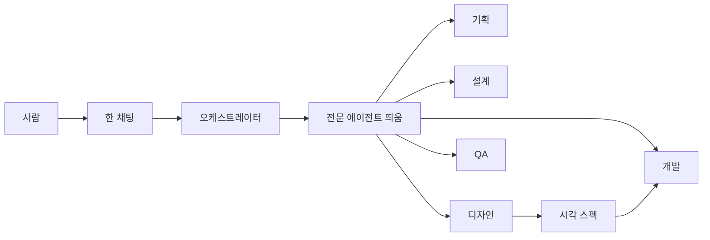

# Architecture

프로토콜 템플릿의 구조. 앱 런타임·DB는 없다.

## Overview

사람은 **한 채팅**의 오케스트레이터와만 대화한다. 오케스트레이터는 단계에 맞는 **전문 에이전트**를 띄우고, 사람 선택 후에만 `gate.sh`를 돌린다.  
지시(`AGENTS.md` / `CLAUDE.md`)와 **Skill**(Quality bar)은 도구별 스킬 경로에 두고, **Agent 정의**(격리·띄우기)는 도구별 에이전트 경로에 둔다. 게이트는 CLI+git hook으로 공통. Cursor 훅은 Cursor 전용.

### 현재 (Phase 1 Implement 후)

- 에이전트 다섯이 네 경로에 있음: `.cursor/agents/*.md`, `.claude/agents/*.md`, `.agents/agents/*.md` (`subagent: true`), `.codex/agents/*.toml`
- `delivery-phase` / `project-kickoff`에 **Specialist launch** (호스트 spawn, 없으면 Isolation Pass, 오케스트레이터 본문 금지)
- `phase-gate`: 전문 에이전트는 mutating `gate.sh` 금지
- `senior-*` Skill: spawn된 전문가 문단. 세 스킬 경로 동일
- 사람 가이드는 Phase 2: `guide.md` §2-2에 오케스트레이터 + 전문 에이전트. FAQ에 디자이너/기획자 질문.

## Application Structure

| 경로 | 누가 읽나 | 역할 |
|------|-----------|------|
| `.cursor/skills/<name>/SKILL.md` | Cursor | 스킬 **원본** (8개, Quality bar) |
| `.claude/skills/<name>/` | Claude Code | 원본과 **동일 내용 실파일** |
| `.agents/skills/<name>/` | Codex, Antigravity | 원본과 **동일 내용 실파일** |
| `.cursor/agents/<name>.md` | Cursor | 전문 에이전트 정의 (Markdown + YAML) |
| `.claude/agents/<name>.md` | Claude Code | 동일 역할, Claude 형식 |
| `.agents/agents/<name>.md` | Antigravity | 동일 역할, `subagent: true` |
| `.codex/agents/<name>.toml` | Codex | 동일 역할, TOML |
| `AGENTS.md` | 공통 | 상시 규칙 |
| `CLAUDE.md` | Claude Code | `AGENTS.md`를 가리키는 진입 |
| `.cursor/gate.json` + `scripts/gate.sh` | 공통 CLI | 단계·승인 상태 |
| `.githooks/pre-commit` | git (도구 무관) | 커밋 잠금 |
| `.cursor/hooks.json` | Cursor만 | 구현 전 쓰기 차단 |

스킬 세트(워크플로 3 + 역할 5): `project-kickoff`, `delivery-phase`, `phase-gate`, `senior-architect`, `senior-pm`, `senior-design`, `senior-dev`, `senior-qa`.  
에이전트 다섯 이름: `senior-pm`, `senior-architect`, `senior-design`, `senior-dev`, `senior-qa`.  
에이전트 파일은 **얇은 래퍼**다. Quality bar는 Skill을 읽고, 본문을 네 번째 복사하지 않는다.

### 오케스트레이터 vs 전문 에이전트

- **오케스트레이터 (부모):** `project-kickoff` / `delivery-phase` / `phase-gate`. 단계 매핑, spawn, 한눈 그림·선택 UI, 사람 선택 후 `gate.sh`. **본문(기획서·시각 스펙·코드·UTG)을 쓰지 않는다.**
- **전문 에이전트 (자식):** 호스트 서브에이전트. 자체 컨텍스트. 오케스트레이터가 입력 패키지(관련 docs/plan 경로, 이전 산출물, 이번 In/Out)를 넘긴다. mutating `gate.sh` 금지. `gate.json` 직접 수정 금지.

### 단계 → 띄울 에이전트 (순차)

| 단계 | 전문 에이전트 |
|------|----------------|
| K1 | 기획 |
| K2 | 기획 → 설계 → (제품 UI면) 디자인 |
| K3 | 기획(`docs/product.md`) → 설계(`docs/architecture.md` 등) |
| K4 | 기획 → 설계 |
| Explore | 설계 |
| Document | 문서 성격에 따라 설계 또는 기획 |
| Plan | 기획 → (UI면) 디자인 |
| Implement | 개발 (디자인 스펙 준수) |
| Verify | QA |
| Review | QA → 설계 |

사용자 명시 호출이 있으면 그 에이전트만 띄운다.

### 호스트 어댑터

1. **네이티브 spawn이 있으면 반드시 사용** (Cursor Task/커스텀 서브에이전트, Claude Code `.claude/agents/`, Codex spawn, Antigravity `invoke_subagent`)
2. **없으면 Isolation Pass:** `▶ 전문 에이전트 시작: 시니어 ○○` / `▶ 종료`. 그 구간은 해당 Skill만. spawn을 건너뛰고 한 응답에서 기획+디자인+구현을 섞는 것은 실패.

## Data Flow

글 흐름: 사람 → 오케스트레이터(단계·게이트) → 해당 전문 에이전트 → 산출물 → 사람 승인

- **Skill 원본:** `.cursor/skills/` 를 고친 뒤 `.claude/skills/`와 `.agents/skills/`를 같이 맞춘다.
- **Agent 정의:** 역할 문구를 바꾸면 Cursor / Claude / Antigravity / Codex 네 경로를 같이 맞춘다. Cursor는 `.cursor/agents/`만, Codex는 `.codex/agents/` TOML만 쓴다 (형식 충돌 방지).
- **게이트 상태:** `.cursor/gate.json`만. Agent는 직접 수정하지 않고, 사람 선택 후 오케스트레이터가 `gate.sh`만 실행한다.
- 비밀·사용자 데이터 저장소 없음.

## External Services

없음. 각 도구의 스킬 디스커버리와 서브에이전트 spawn만 사용한다. (제품 UI Phase에서 디자인 에이전트가 Figma MCP를 쓰는 것은 선택.)

## Boundaries

- **In:** 에이전트 정의 파일, 워크플로 Skill의 spawn 의무, guide/workflow의 “한 Agent가 관점만 교체” 문구 교체, 기존 스킬 세 경로
- **Out:** Marketplace 봇, 단계 이름 변경, `src/` 앱, 역할별 모델 강제, 게이트 상태 머신 의미 변경, 심볼릭 링크·설치 스크립트
- **채택:** 네이티브 서브에이전트 + 호스트별 실파일. Skill은 Quality bar, Agent는 격리.
- **채택:** Isolation Pass를 spawn 불가 시의 공식 폴백 (사람 흐름은 같게).
- **기각:** 역할 Skill만 바꿔 같은 세션이 본문을 쓰는 현재 방식 — 문제를 풀지 못함.
- **기각:** 사람이 채팅을 역할마다 따로 열기.

## Failure modes

- 오케스트레이터가 spawn 없이 본문을 씀 → 워크플로 Skill에 금지. “디자이너가 했나?”의 정답이 다시 아니가 됨
- 에이전트 파일만 고치고 Skill은 안 고침 → Quality bar가 갈라짐. 에이전트는 Skill을 읽게 함
- 한 호스트 경로만 추가 → 그 도구만 전문 에이전트가 없음
- 서브에이전트가 대화 이력을 못 봄 → 오케스트레이터가 입력 패키지를 프롬프트에 넣음
- Cursor Task가 모델에 없음 → Isolation Pass. 가이드에 밝힘
