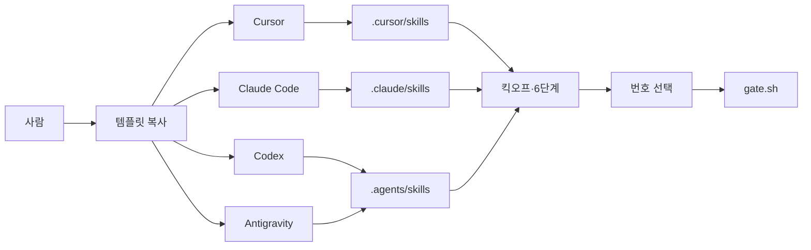

# Architecture

프로토콜 템플릿의 구조. 앱 런타임·DB는 없다.

## Overview

지시(`AGENTS.md` / `CLAUDE.md`)와 스킬 폴더를 도구별 디스커버리 경로에 두고, 게이트는 CLI+git hook으로 공통 유지한다. Cursor 훅은 Cursor 전용이다.

## Application Structure

| 경로 | 누가 읽나 | 역할 |
|------|-----------|------|
| `.cursor/skills/<name>/SKILL.md` | Cursor | 스킬 **원본** (8개) |
| `.claude/skills/<name>/` | Claude Code | 원본과 **동일 내용 실파일** |
| `.agents/skills/<name>/` | Codex, Antigravity | 원본과 **동일 내용 실파일** |
| `AGENTS.md` | 공통 (Codex·Antigravity·Cursor 등) | 상시 규칙 |
| `CLAUDE.md` | Claude Code | `AGENTS.md`를 가리키는 도구별 진입 |
| `.cursor/gate.json` + `scripts/gate.sh` | 공통 CLI | 단계·승인 상태 |
| `.githooks/pre-commit` | git (도구 무관) | 커밋 잠금 |
| `.cursor/hooks.json` | Cursor만 | 구현 전 쓰기 차단 |

스킬 세트: `project-kickoff`, `delivery-phase`, `phase-gate`, `senior-architect`, `senior-pm`, `senior-design`, `senior-dev`, `senior-qa`.

### 현재 (Phase 1 Implement 후)

- `.cursor/skills/`, `.claude/skills/`, `.agents/skills/`에 같은 스킬 8개가 실파일로 있음 (`README.md`는 `.cursor/skills/`만).
- `.gitignore` / `.cursorignore`는 위 경로를 무시하지 않음.
- `AGENTS.md` / `CLAUDE.md`에 세 경로가 적혀 있음.
- 스킬 본문: 구조화 질문 도구가 있으면 사용, 없으면 한글 번호. 파일은 에디터에서 연다 (Cursor는 Cmd+P).

## Data Flow

글 흐름: 사람 → 템플릿 복사 → 도구별 스킬 폴더 → 킥오프·6단계 → 번호로 승인 → gate.sh

- **원본:** `.cursor/skills/` 를 고친 뒤 `.claude/skills/`와 `.agents/skills/`를 같이 맞춘다. 한 경로만 고치면 도구마다 프로토콜이 갈라진다.
- **게이트 상태:** `.cursor/gate.json`만. Agent는 이 파일을 직접 수정하지 않고, 사람 선택 후 `gate.sh`만 실행한다.
- 비밀·사용자 데이터 저장소 없음.

## External Services

없음. 각 도구의 스킬 디스커버리만 사용한다.

## Boundaries

- **In:** 스킬 복제, 공통 지시 문구(번호 선택·에디터에서 경로 열기), `guide.md` 등 사람 가이드
- **Out:** 다른 도구 훅, 심볼릭 링크, 설치 스크립트, `.codex/skills/` (Verify에서 Codex가 `.agents/skills`를 못 읽을 때만 Later)
- **채택:** 실파일 복제 — 다른 PC·Windows에서 클론만으로 동작
- **기각:** 링크·설치 스크립트 — K1에서 클론·복사만으로 붙이기로 함

## Failure modes

- 한 스킬 폴더만 수정 → 도구별 행동 불일치
- 도구가 스킬 경로를 안 읽음 → `AGENTS.md`/`guide.md`의 번호 선택 + `gate.sh`로 진행
- 클릭 카드 없음 → 한글 번호 대체 (버그 아님)

### 사람 가이드 (Phase 2 Implement 후)

`guide.md` §1에 도구별 스킬 경로와 번호 선택 기본(다른 도구)이 있다. `TEMPLATE.md` · `docs/ai/agent-workflow.md` · `.cursor/skills/README.md`도 세 경로를 가리킨다. 훅은 Cursor만.
