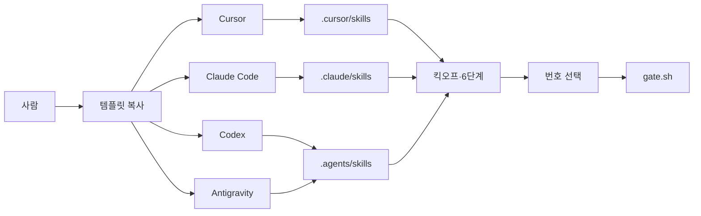

# Product

이 저장소는 앱이 아니라 **AI와 같이 개발하기 위한 프로토콜 템플릿**이다.  
사람은 Cursor, Claude Code, Codex, Antigravity 중 어디서 열어도 **같은 킥오프·6단계·게이트**로 일하게 한다.

## Problem / Users

템플릿을 복사해 쓰는 개발자. Cursor가 아닌 도구를 열면 스킬이 안 붙고, 킥오프·승인 흐름이 Cursor와 달라진다.

## Must-have

- Claude Code, Codex, Antigravity가 프로젝트 스킬 8개를 자동으로 읽음 (워크플로 3 + 시니어 역할 5)
- 킥오프 K1–K4, Delivery 6단계, `./scripts/gate.sh` + 채팅 번호 선택이 세 도구에서 같음
- 클론·폴더 복사만 하면 됨 (설치 스크립트·심볼릭 링크 없음)
- 클릭 카드는 그 도구가 질문 UI를 줄 때만. 없으면 한글 번호 `1`/`2`/`3`

## Later

- 다른 도구용 쓰기 차단 훅
- 모든 도구에서 클릭 카드 보장
- 스킬 원본 한곳 + 링크/생성 스크립트
- Codex가 `.agents/skills`를 못 찾을 때만 `.codex/skills/` 추가 복제

## Journeys

글 흐름: 사람 → 템플릿 복사 → 도구별 스킬 폴더 → 킥오프·6단계 → 번호로 승인 → gate.sh

## Out of scope

- 다른 도구용 파일 쓰기 훅
- 모든 도구에서 AskQuestion/클릭 카드 보장
- 심볼릭 링크, 클론 후 설치 스크립트
- 앱 `src/` 기능
- Cursor Marketplace 플러그인 재패키징
- 게이트 상태 머신 변경
