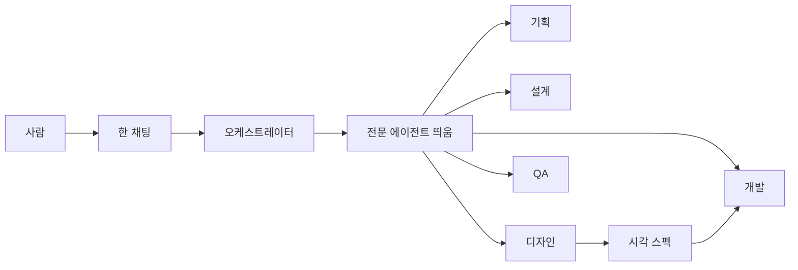

# Product

이 저장소는 앱이 아니라 **AI와 같이 개발하기 위한 프로토콜 템플릿**이다.  
사람은 Cursor, Claude Code, Codex, Antigravity 중 어디서 열어도 **같은 킥오프·6단계·게이트**로 일한다.  
프로젝트를 만들 때 기획·설계·디자인·개발·QA **본문은 각각 전문 에이전트**가 쓰고, 사람은 **채팅 하나**에서 승인한다.

## Problem / Users

템플릿을 복사해 쓰는 개발자. 완료된 화면을 보고 “디자이너 에이전트가 한 거냐”, 범위를 보고 “기획 에이전트가 한 거냐”고 물으면, 지금은 **한 Agent가 역할 Skill만 바꿔** 전부 한 것이라서 **아니다**가 맞다. 파트마다 전문 에이전트가 그 일을 하기를 원한다.

## Must-have

- 사람은 **채팅 하나**. 단계가 되면 **오케스트레이터**가 해당 전문 에이전트를 자동으로 띄운다
- 전문 에이전트 다섯: **기획 / 설계 / 디자인 / 개발 / QA**
- 오케스트레이터는 **단계 전환과 게이트만**. 기획·설계·디자인·코드·검수 본문은 해당 에이전트만 쓴다
- Cursor, Claude Code, Codex, Antigravity에서 **사람 경험은 같게** (한 창, 같은 단계, 같은 승인)
- 킥오프 K1–K4, Delivery 6단계, `./scripts/gate.sh` + 채팅 선택(카드 또는 번호)은 **유지**
- 화면이 있는 Phase는 Plan에서 **디자인 에이전트 필수**. gate enabled 시 Delivery 단계마다 `approve-explore` / `approve-document` / `approve-plan-body` / `approve-design-spec`(UI) / `approve-verify` 없이 advance·코드·커밋 훅 차단
- 클론·폴더 복사만 하면 됨 (설치 스크립트·심볼릭 링크 없음)
- 기존과 같이 워크플로·역할 **Skill 8개**가 도구별 경로에 있다 (Quality bar 원본)

## Later

- 역할마다 다른 모델 고정
- Cursor Marketplace 다중 봇
- 도구별 쓰기 차단 훅을 전문 에이전트 권한과 맞추기
- 서브에이전트 API가 없는 환경에서 프로세스 수준 격리 (지금은 Isolation Pass)
- 모든 도구에서 클릭 카드 보장
- 스킬 원본 한곳 + 링크/생성 스크립트

## Journeys

글 흐름: 사람 → 오케스트레이터(단계·게이트) → 해당 전문 에이전트 → 산출물 → 사람 승인

## Out of scope

- 사람이 기획/디자인/개발/QA 채팅을 각각 여는 것을 필수 UX로 만들기
- Marketplace / 별도 프로세스 오케스트레이터 제품
- Delivery 단계 이름을 역할명으로 바꾸기
- 앱 `src/` 기능
- 역할마다 다른 LLM 강제
- 역할마다 다른 git 워크트리 강제
- 게이트 상태 머신 의미 변경
- 심볼릭 링크, 클론 후 설치 스크립트
